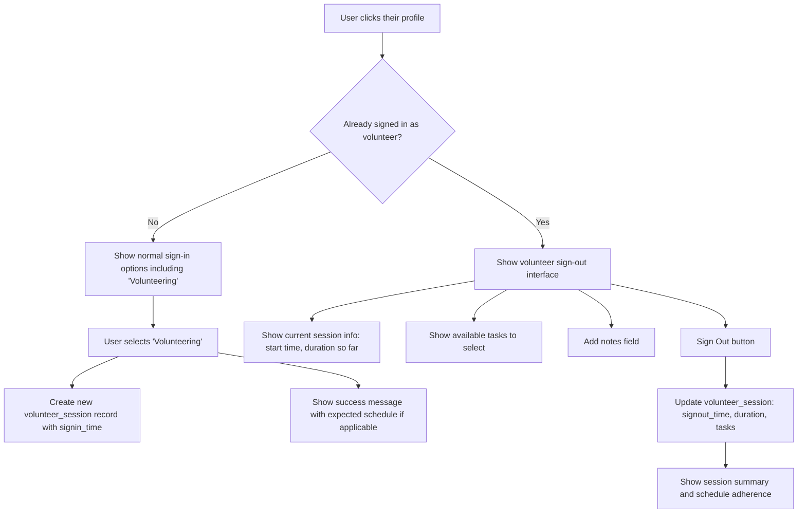

# Volunteer Time Tracking System - Implementation Plan

## Overview

Enhance the existing Make Santa Fe membership plugin to include comprehensive volunteer time tracking with sign-in/sign-out functionality, task management, scheduling, and administrative reporting.

## Database Changes

### 1. New Table: `volunteer_sessions`

```sql
CREATE TABLE volunteer_sessions (
  id INT NOT NULL AUTO_INCREMENT,
  user_id INT NOT NULL,
  signin_time DATETIME NOT NULL,
  signout_time DATETIME NULL,
  duration_minutes INT NULL,
  tasks_completed TEXT NULL, -- JSON array of task IDs
  notes TEXT NULL,
  status ENUM('active', 'completed') DEFAULT 'active',
  PRIMARY KEY (id),
  INDEX idx_user_id (user_id),
  INDEX idx_signin_time (signin_time),
  INDEX idx_status (status)
);
```

### 2. New Table: `volunteer_schedules`

```sql
CREATE TABLE volunteer_schedules (
  id INT NOT NULL AUTO_INCREMENT,
  user_id INT NOT NULL,
  day_of_week TINYINT NOT NULL, -- 0=Sunday, 1=Monday, etc.
  start_time TIME NOT NULL,
  end_time TIME NOT NULL,
  is_active BOOLEAN DEFAULT 1,
  created_date DATETIME DEFAULT CURRENT_TIMESTAMP,
  PRIMARY KEY (id),
  INDEX idx_user_id (user_id),
  INDEX idx_day_of_week (day_of_week),
  UNIQUE KEY unique_user_day_time (user_id, day_of_week, start_time)
);
```

### 3. New User Meta Fields

- `volunteer_orientation_completed` (boolean)
- `volunteer_orientation_date` (datetime)
- `volunteer_start_date` (datetime - first volunteer sign-in)
- `volunteer_schedule_type` (enum: 'scheduled', 'flexible', 'none')

## Custom Post Type: `volunteer_task`

```php
// Post type with ACF fields:
- Title (post_title)
- Description (post_content)
- Estimated Duration (ACF field - number in minutes)
- Category/Department (custom taxonomy: volunteer_task_category)
- Status (Active/Inactive - post_status)
- Priority (ACF field: Low/Medium/High)
- Instructions (ACF field - textarea)
```

## Frontend Changes

### Enhanced Member Sign-In Block



### New AJAX Endpoints

1. `makeVolunteerSignOut` - Handle volunteer sign-out with tasks and notes
2. `makeGetVolunteerSession` - Get current volunteer session info
3. `makeGetVolunteerTasks` - Get available tasks for selection
4. `makeGetVolunteerSchedule` - Get volunteer's expected schedule for today

## Admin Interface: "Volunteering" Menu

### Main Menu Structure

```
Volunteering
├── Dashboard (Overview/Reports)
├── Volunteer Sessions
├── Volunteer Tasks
├── Volunteers (Individual profiles)
├── Schedules
└── Settings
```

### 1. Volunteer Dashboard (`/wp-admin/admin.php?page=volunteer-dashboard`)

**Key Metrics Section:**

- Total active volunteers
- Total hours this month
- Average session length
- Volunteers who hit monthly target (configurable, default 12 hours)

**Charts and Graphs:**

- Monthly hours trend
- Top volunteers this month
- Schedule adherence rate
- Task completion statistics

**Recent Activity:**

- Recent volunteer sessions (last 10)
- Currently active volunteer sessions
- Volunteers scheduled for today vs. actual sign-ins

### 2. Volunteer Sessions (`/wp-admin/admin.php?page=volunteer-sessions`)

**Features:**

- Filterable list of all volunteer sessions
- Columns: Volunteer, Date, Duration, Tasks, Schedule Status (On Time/Late/Early/Unscheduled)
- Export functionality (CSV)
- Bulk actions (delete, mark complete)
- Search by volunteer name, date range, task

### 3. Volunteer Tasks (`/wp-admin/admin.php?page=volunteer-tasks`)

**Features:**

- CRUD interface for volunteer tasks
- Task categories management (custom taxonomy)
- Usage statistics per task
- Estimated vs. actual time tracking

### 4. Volunteers (`/wp-admin/admin.php?page=volunteers`)

**Volunteer List View:**

- Total hours (all time, this month)
- Start date
- Orientation status (checkbox to mark complete)
- Last session date
- Schedule adherence percentage
- Badges earned
- Monthly progress toward target

**Individual Volunteer Detail Page:**

- Personal info and badges
- Orientation tracking
- Schedule management interface
- Session history
- Task completion history
- Monthly hours chart

### 5. Schedules (`/wp-admin/admin.php?page=volunteer-schedules`)

**Features:**

- Calendar view of all volunteer schedules
- List view with filters by day/volunteer
- Bulk schedule management
- Schedule conflict detection
- Expected vs. actual attendance reports

## Volunteer Scheduling System

### Schedule Types

1. **Scheduled**: Regular weekly recurring schedule
2. **Flexible**: No set schedule, can volunteer anytime
3. **None**: Not currently volunteering

### Schedule Management Interface

**For Individual Volunteers:**

```
Volunteer Schedule for [Name]
Schedule Type: [Dropdown: Scheduled/Flexible/None]

[If Scheduled is selected:]
Weekly Schedule:
☐ Sunday    [Start Time] to [End Time] [Remove]
☐ Monday    [Start Time] to [End Time] [Remove]
☐ Tuesday   [Start Time] to [End Time] [Remove]
☐ Wednesday [Start Time] to [End Time] [Remove]
☐ Thursday  [Start Time] to [End Time] [Remove]
☐ Friday    [Start Time] to [End Time] [Remove]
☐ Saturday  [Start Time] to [End Time] [Remove]

[Add New Schedule Slot] button
```

### Schedule Adherence Tracking

**Metrics:**

- On Time: Signed in within 15 minutes of scheduled start
- Late: Signed in more than 15 minutes after scheduled start
- Early: Signed in before scheduled start
- No Show: Didn't sign in during scheduled time
- Unscheduled: Signed in when not scheduled

## File Structure

```
inc/
├── volunteer/
│   ├── volunteer-cpt.php          # Custom post type registration
│   ├── volunteer-admin.php        # Admin menu and pages
│   ├── volunteer-ajax.php         # AJAX handlers
│   ├── volunteer-functions.php    # Utility functions
│   ├── volunteer-database.php     # Database operations
│   ├── volunteer-schedules.php    # Schedule management
│   └── volunteer-reports.php      # Reporting functions
├── templates/
│   └── volunteer-signout.php      # Sign-out interface template
assets/
├── js/
│   ├── volunteer.js               # Frontend JavaScript
│   └── volunteer-admin.js         # Admin interface JavaScript
└── css/
    ├── volunteer.css              # Frontend styling
    └── volunteer-admin.css        # Admin styling
```

## Implementation Phases

### Phase 1: Database & Core Functionality (Week 1)

1. Create `volunteer_sessions` and `volunteer_schedules` tables
2. Add user meta fields
3. Create volunteer custom post type and taxonomy
4. Implement basic sign-in/sign-out logic

### Phase 2: Enhanced Sign-In Interface (Week 2)

1. Modify existing sign-in block to detect active volunteer sessions
2. Add sign-out interface with task selection and notes
3. Update AJAX handlers
4. Add schedule awareness to sign-in process

### Phase 3: Admin Interface - Core (Week 3)

1. Create "Volunteering" admin menu
2. Build dashboard with basic reporting
3. Create volunteer sessions management page
4. Add volunteer tasks CRUD interface

### Phase 4: Scheduling System (Week 4)

1. Build schedule management interface
2. Add schedule adherence tracking
3. Create schedules admin page
4. Integrate schedule data into dashboard

### Phase 5: Advanced Features (Week 5)

1. Individual volunteer profile pages
2. Advanced reporting and analytics
3. Export functionality
4. Orientation tracking interface

## Key Functions to Implement

### Core Volunteer Functions

```php
function make_start_volunteer_session($user_id)
function make_end_volunteer_session($session_id, $tasks = [], $notes = '')
function make_get_active_volunteer_session($user_id)
function make_get_volunteer_hours($user_id, $period = 'month')
function make_get_volunteer_stats($period = 'month')
```

### Schedule Functions

```php
function make_add_volunteer_schedule($user_id, $day_of_week, $start_time, $end_time)
function make_get_volunteer_schedule($user_id)
function make_get_expected_volunteers_today()
function make_check_schedule_adherence($user_id, $signin_time)
function make_get_schedule_adherence_rate($user_id, $period = 'month')
```

### Task Functions

```php
function make_get_available_volunteer_tasks()
function make_record_task_completion($session_id, $task_ids)
function make_get_task_statistics($task_id = null)
```

### Admin Functions

```php
function make_mark_orientation_complete($user_id, $date = null)
function make_get_volunteer_leaderboard($period = 'month', $limit = 10)
function make_export_volunteer_data($filters = [])
```

## Configuration Options

Add to plugin settings:

- Monthly volunteer hour target (default: 12)
- Volunteer orientation required (yes/no)
- Auto sign-out after X hours (safety feature, default: 8)
- Schedule adherence tolerance (minutes, default: 15)
- Default volunteer task categories

## Reporting Features

### Dashboard Reports

1. **Monthly Hours Summary**: Total hours, average per volunteer, target achievement
2. **Schedule Adherence**: On-time percentage, late arrivals, no-shows
3. **Task Completion**: Most popular tasks, completion rates, time estimates vs. actual
4. **Volunteer Engagement**: New volunteers, returning volunteers, retention rates

### Exportable Reports

1. **Volunteer Hours Report**: Detailed hours by volunteer and date range
2. **Schedule Adherence Report**: Detailed schedule vs. actual attendance
3. **Task Completion Report**: Tasks completed by volunteer and time period
4. **Volunteer Directory**: Contact info, schedules, and stats

## Integration Points

### Existing System Integration

- Leverage existing user management and badge system
- Integrate with current sign-in statistics
- Use existing AJAX framework and styling
- Maintain compatibility with current member sign-in flow

### Future Enhancements

- Email notifications for schedule reminders
- Volunteer self-service portal (frontend)
- Mobile app integration
- Integration with calendar systems
- Automated volunteer recognition/rewards

## Security Considerations

- All volunteer data access requires appropriate WordPress capabilities
- AJAX endpoints include nonce verification
- Schedule data is protected from unauthorized access
- Export functionality requires admin privileges
- Session data includes user validation

## Testing Strategy

1. **Unit Tests**: Core functions for time calculation, schedule adherence
2. **Integration Tests**: Sign-in/sign-out flow, database operations
3. **User Acceptance Tests**: Admin interface usability, reporting accuracy
4. **Performance Tests**: Large dataset handling, export functionality

---

This comprehensive plan provides a robust volunteer time tracking system that integrates seamlessly with the existing Make Santa Fe membership plugin while providing the flexibility for future enhancements.
